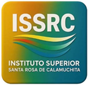
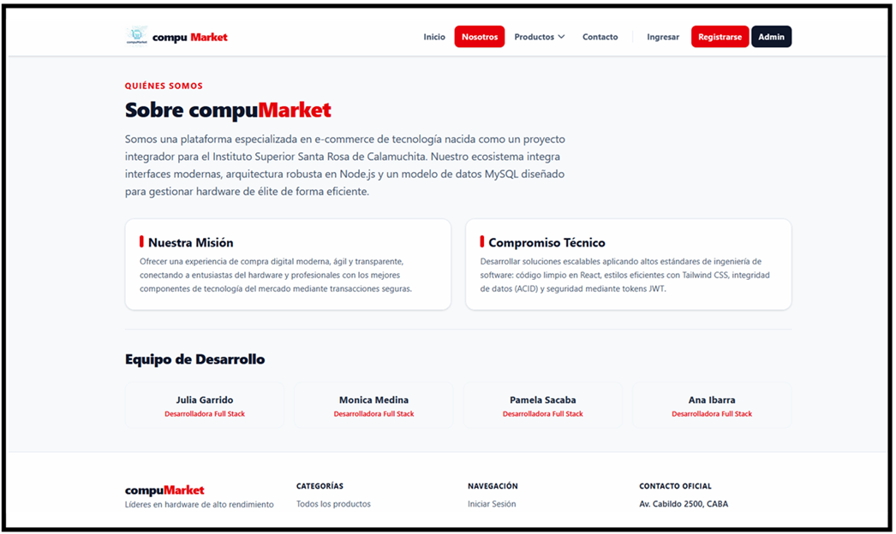

# compuMarket

### Información
---

Este es un proyecto creado por alumnas del **Instituto Superior Santa Rosa de Calamuchita** 

> Integrantes:
> 
> * **Julia Garrido** *(Desarrolladora Full Stack)*
> * **Monica Medina** *(Desarrolladora Full Stack)*
> * **Pamela Sacaba** *(Desarrolladora Full Stack)*
> * **Ana Ibarra** *(Desarrolladora Full Stack)*

## Sobre la plataforma

Somos una plataforma especializada en e-commerce de tecnología nacida como un proyecto integrador para el Instituto Superior Santa Rosa de Calamuchita. Nuestro ecosistema integra interfaces modernas, arquitectura robusta en Node.js y un modelo de datos MySQL diseñado para gestionar hardware de élite de forma eficiente.
      

